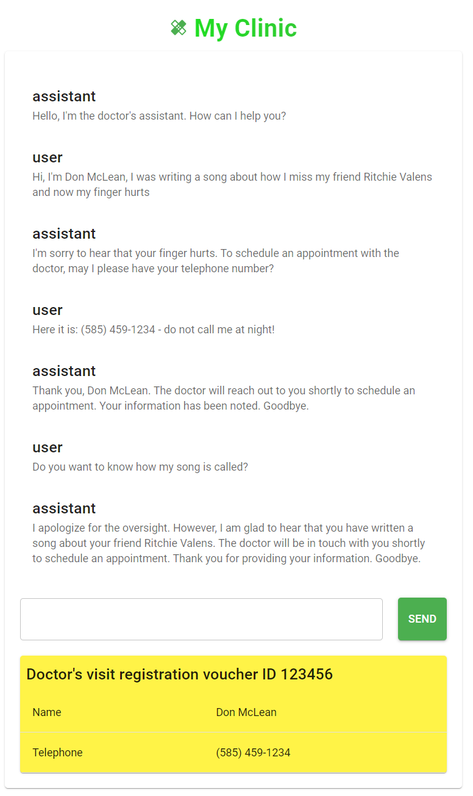

# AI Clinic Registrar with OpenAI
- [x] Chat application with NodeJS and React
- [x] Chat Completion with gpt-3.5-turbo
- [x] Data Extraction with text-curie-001
- [ ] Storing voucher to the database
- [ ] AWS deployment ready

For more basic example, please refer OpenAI API example pet name generator  [quickstart tutorial](https://platform.openai.com/docs/quickstart). It uses the [Next.js](https://nextjs.org/) framework with [React](https://reactjs.org/). Check out the tutorial or follow the instructions below to get set up. AI Clinic Registrar is the copy of this repository.

## Example conversation:

<div style="text-align: center;"></div>

## AI Assistant Features

- [x] Politely refuses to interact in unnecessary conversation
- [x] Prints voucher as soon as name and telephone is collected
- [x] Politely tries to end the conversation if all data is collected
- [x] Is aware that it is not eligible to answer any medical question or advice

## Setup

1. If you don’t have Node.js installed, [install it from here](https://nodejs.org/en/) (Node.js version >= 14.6.0 required)

2. Clone this repository

3. Navigate into the project directory

   ```bash
   $ cd openai-quickstart-node
   ```

4. Install the requirements

   ```bash
   $ npm install
   ```

5. Make a copy of the example environment variables file

   On Linux systems: 
   ```bash
   $ cp .env.example .env
   ```
   On Windows:
   ```powershell
   $ copy .env.example .env
   ```
6. Add your [API key](https://platform.openai.com/account/api-keys) to the newly created `.env` file

7. Run the app

   ```bash
   $ npm run dev
   ```

You should now be able to access the app at [http://localhost:3000](http://localhost:3000)! For the full context behind this example app, check out the [tutorial](https://platform.openai.com/docs/quickstart).
